# Seasonal & Weather Wallpapers

  <strong>Click any preview to open the full-size wallpaper.</strong>

<table width="100%">
<tr><td><a href="abandoned-trainstation.jpg">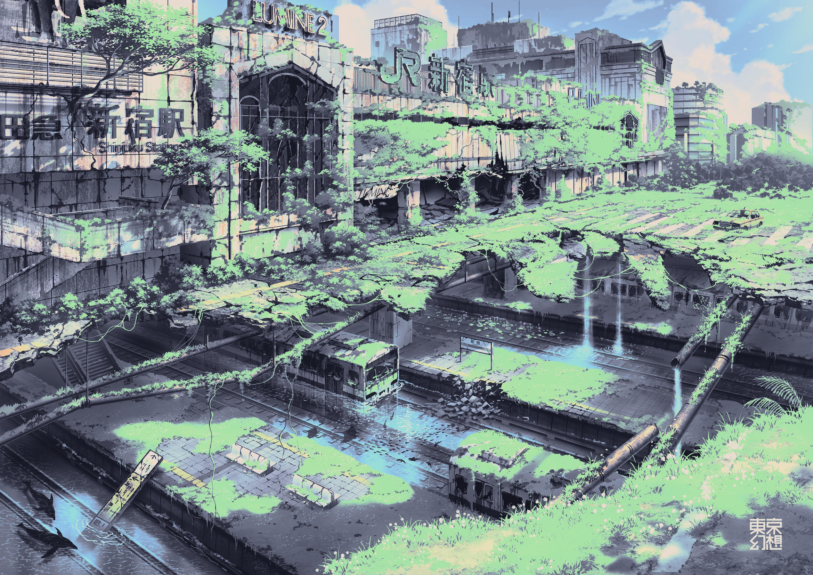</a></td><td><a href="c4-spring-sakura-sky.jpg">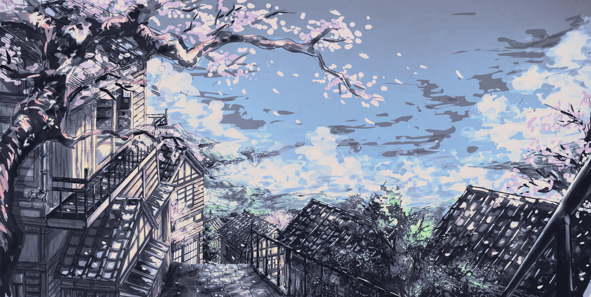</a></td><td><a href="flowering-rain.png">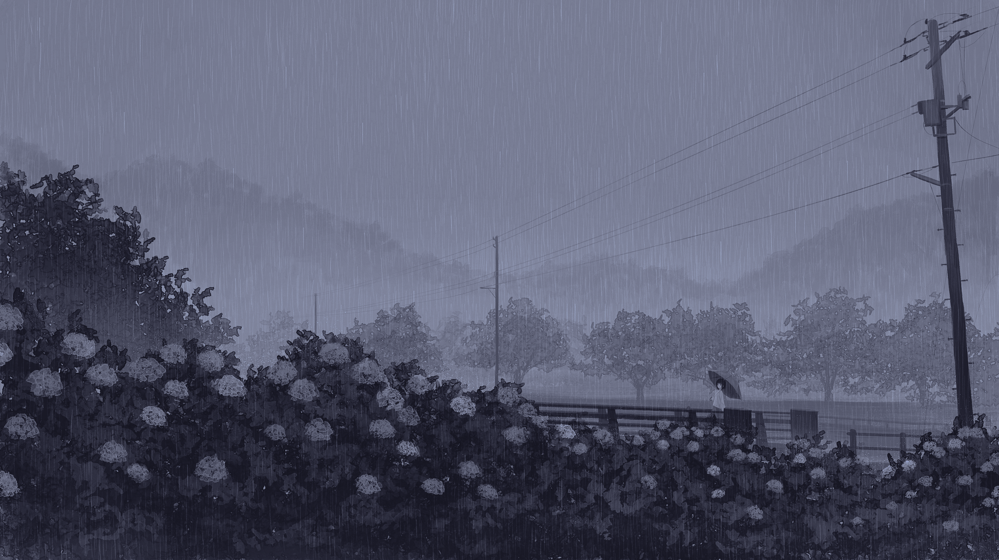</a></td><td><a href="foggy-city.jpg">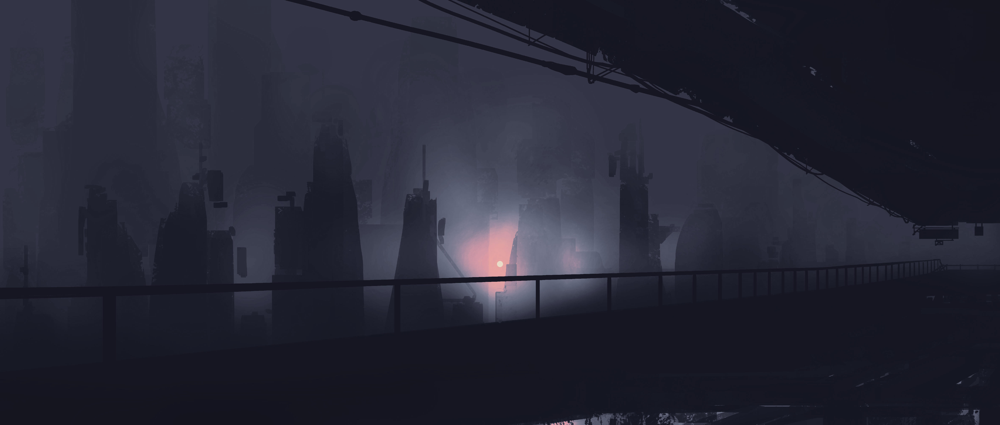</a></td></tr>
<tr><td><a href="lovely-summer.jpg">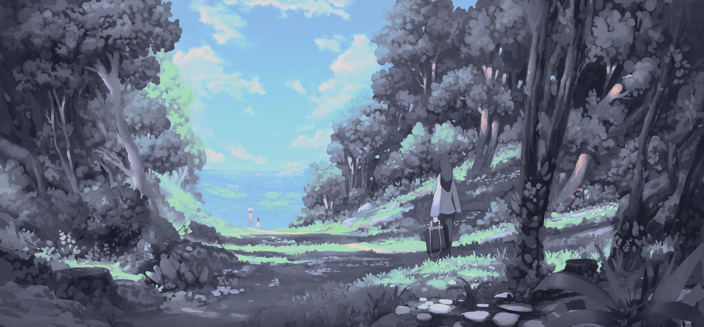</a></td><td><a href="misty-boat.jpg">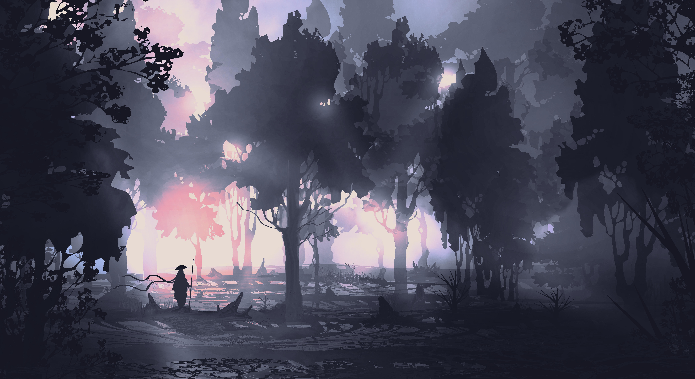</a></td><td><a href="rainy-window.jpeg">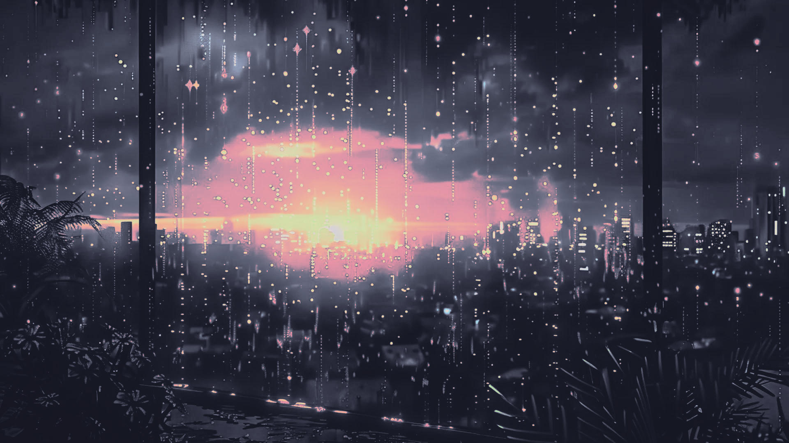</a></td><td><a href="snowflakes.jpg">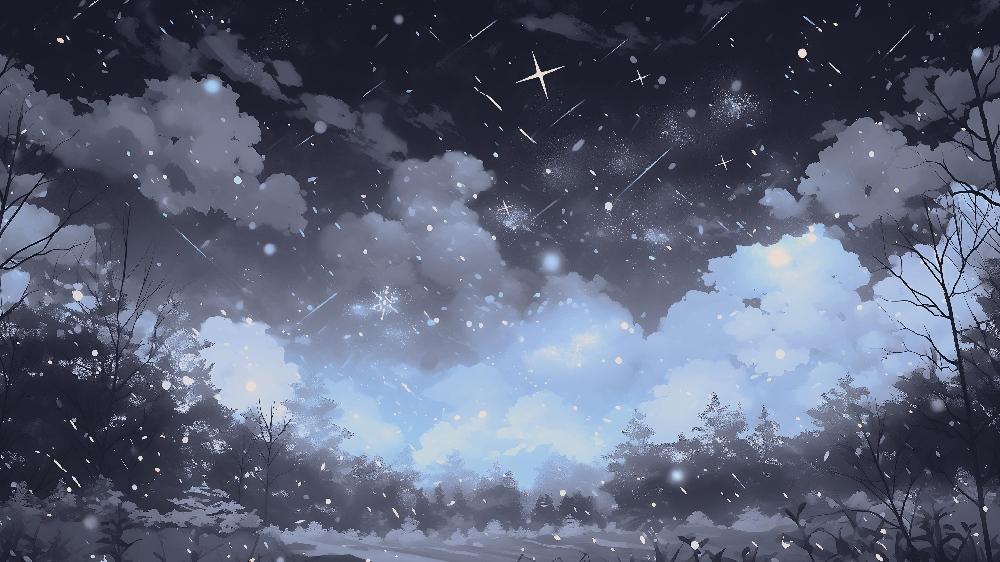</a></td></tr>
<tr><td></td><td><a href="snowy-train.jpg">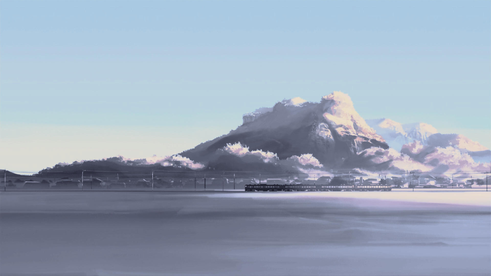</a></td><td></td><td></td></tr>
<tr><td></td><td><a href="train-station.jpg">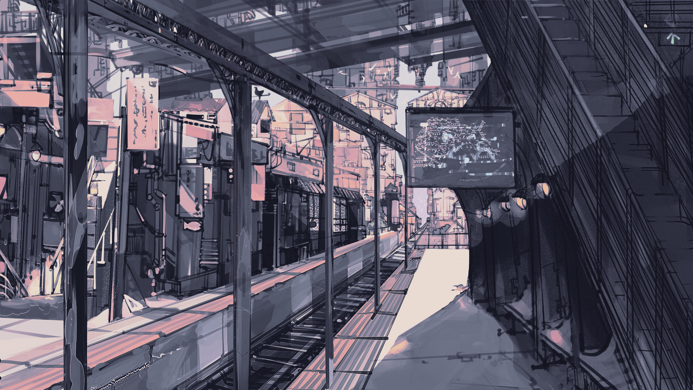</a></td><td><a href="waterfall.png">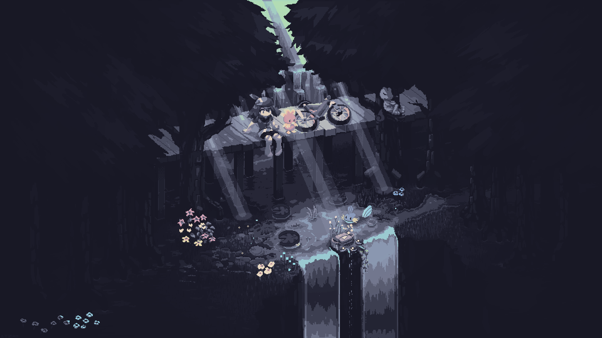</a></td><td></td></tr>
</table>
