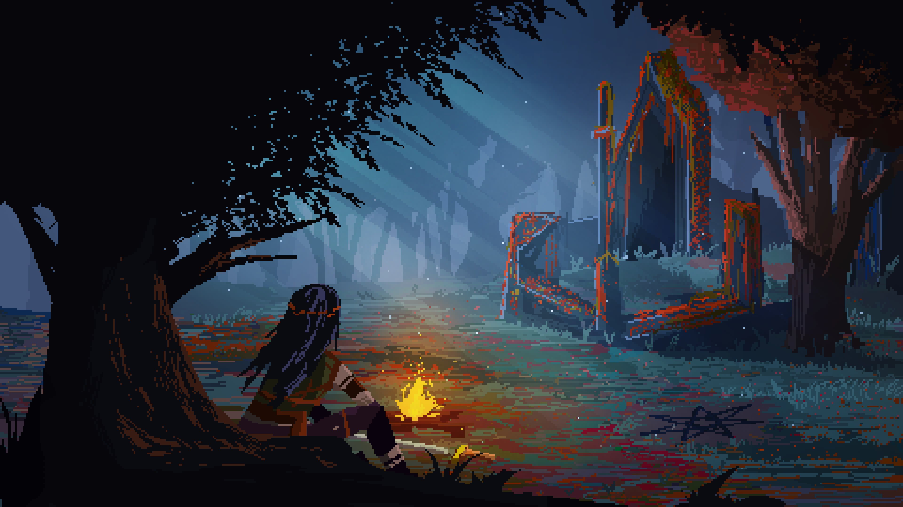
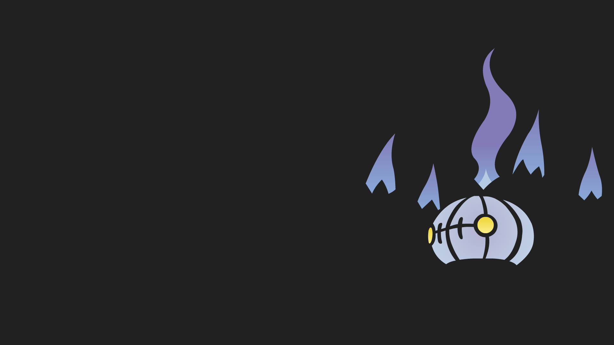

# Wallpapers

	<strong>Click any preview to open the full-size wallpaper.</strong>

<table width="100%">
<tr><td></td><td></td><td></td><td></td></tr>
<tr><td></td><td></td><td></td><td></td></tr>
</table>
